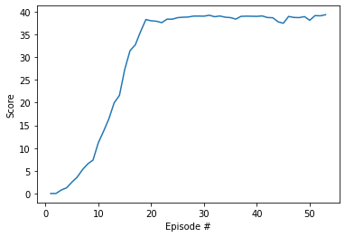

# Deep Reinforcement Learning Nanodegree
# Project 1: Navigation

This repository includes the code to train an execute 20 intelligent agents for the environment Reacher

The agent algorithm is a DDPG, following the vanilla algorithm presented in the original [paper](https://arxiv.org/abs/1509.02971) and the improvements suggested in the Nanodegree lesson.

Most of the algorithm is the DDPG offered to solve the [pendulum environment](https://github.com/udacity/deep-reinforcement-learning/tree/master/ddpg-pendulum). The main differes are:
* Use 20 agents at the same time
* Use gradient clipping when training the critic network
* Update the networks 10 times after every 20 timesteps.
* Modify some hyperparameters:
 * BUFFER_SIZE = int(1e6)  # replay buffer size
 * BATCH_SIZE = 64         # minibatch size
 * GAMMA = 0.99            # discount factor
 * TAU = 1e-3              # for soft update of target parameters
 * LR_ACTOR = 1e-3         # learning rate of the actor
 * LR_CRITIC = 1e-4        # learning rate of the critic
 * WEIGHT_DECAY = 0        # L2 weight decay

The actor is a linear network with 400 and 300 units for the hidden layer. Input size is the state size and output the action size. Activation is relu but for the output layer, were I used tanh.
Similarly, the critic is also linear with 400 and 400 300 units for the hidden layer, but the second layer gets as input the output of the first one and the action. Also, there is no activation for the output layer.

In both cases, batch normalization was applied to the output of the first layer.

The agent solved the environment 53 episodes (average of the average scores of 30.02), with the following evolution

### Future work

There's a lot that can be done here!

First of all, I copied most of the hyperparameters from the original lesson. Experimenting with many of them and seeing how the agent behaves would be very interesting.
I first tried to solve the problem with only 1 agent, without much luck. Understanding why a single agent was not converging would be really interesting.

The, I would try different algorithms. Specially TNPG, TRPO, TPO and D4PG. 
